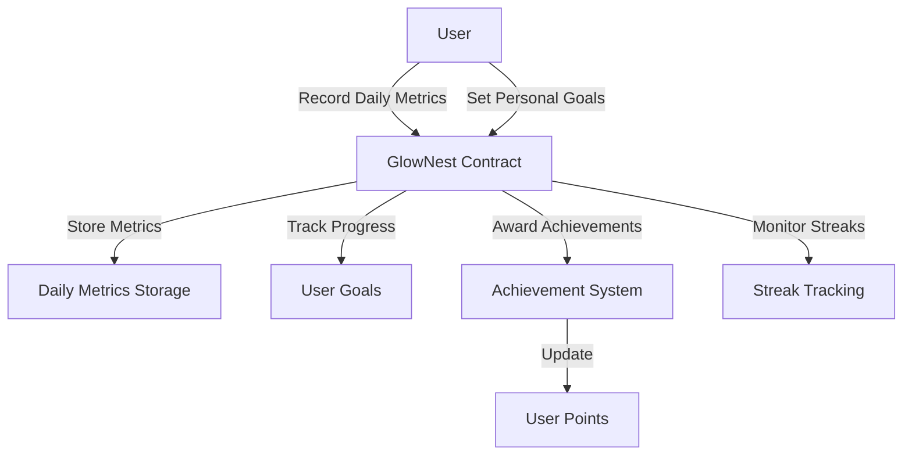

# GlowNest Wellness Tracker

A blockchain-based wellness tracking platform that empowers users to securely manage their personal health data while maintaining complete privacy and data ownership.

## Overview

GlowNest Wellness Tracker is a decentralized application that enables users to:
- Track daily wellness metrics (sleep, hydration, mindfulness)
- Set and monitor personal health goals
- Earn achievements for consistent healthy habits
- Maintain complete ownership of their health data
- Optionally share anonymized data with healthcare providers

The platform provides a privacy-focused alternative to traditional wellness apps, leveraging blockchain technology to ensure data security and user autonomy.

## Architecture

The GlowNest platform is built around a core smart contract that manages:
- Daily wellness metrics recording
- Personal goal setting and tracking
- Achievement system and rewards
- User streak tracking



## Contract Documentation

### glownest-tracker.clar

The main contract handling all wellness tracking functionality.

#### Core Components:
1. **Wellness Metrics Tracking**
   - Records daily sleep, hydration, and mindfulness data
   - Validates data ranges and timestamps
   
2. **Goal Management**
   - Stores user-defined wellness goals
   - Tracks progress towards goals

3. **Achievement System**
   - Awards achievements for meeting goals
   - Tracks achievement points
   - Manages streak-based rewards

4. **Privacy Controls**
   - Data is tied to user principal
   - Only users can access their own data

## Getting Started

### Prerequisites
- Clarinet
- Stacks wallet for testing

### Installation
1. Clone the repository
2. Install dependencies with Clarinet
3. Deploy contracts to desired network

### Basic Usage

1. **Record Daily Metrics**
```clarity
(contract-call? .glownest-tracker record-metrics 
    u20230615 ;; date
    u480      ;; sleep minutes
    u2000     ;; hydration ml
    u20       ;; mindfulness minutes
)
```

2. **Set Personal Goals**
```clarity
(contract-call? .glownest-tracker set-goals
    u480      ;; target sleep minutes
    u2000     ;; target hydration ml
    u20       ;; target mindfulness minutes
)
```

## Function Reference

### Public Functions

#### record-metrics
```clarity
(define-public (record-metrics (date uint) (sleep-minutes uint) (hydration-ml uint) (mindfulness-minutes uint)))
```
Records daily wellness metrics for the user.

#### set-goals
```clarity
(define-public (set-goals (sleep-minutes-goal uint) (hydration-ml-goal uint) (mindfulness-minutes-goal uint)))
```
Sets personal wellness goals for the user.

### Read-Only Functions

#### get-daily-metrics
```clarity
(define-read-only (get-daily-metrics (user principal) (date uint)))
```
Retrieves wellness metrics for a specific date.

#### get-user-goals
```clarity
(define-read-only (get-user-goals (user principal)))
```
Retrieves current wellness goals for a user.

#### get-user-achievements
```clarity
(define-read-only (get-user-achievements (user principal)))
```
Lists all achievements earned by a user.

## Development

### Testing
1. Run the test suite:
```bash
clarinet test
```

### Local Development
1. Start Clarinet console:
```bash
clarinet console
```

2. Deploy contracts:
```bash
clarinet deploy
```

## Security Considerations

### Data Privacy
- All user data is associated with user principal
- No direct access to other users' data
- No centralized data storage

### Limitations
- Data validation is performed on-chain
- Future dates are rejected
- Metric values must fall within defined ranges
- Achievement awards are permanent

### Best Practices
- Always validate transaction success
- Monitor gas costs for data recording
- Regular backup of off-chain data references
- Implement proper error handling for failed transactions